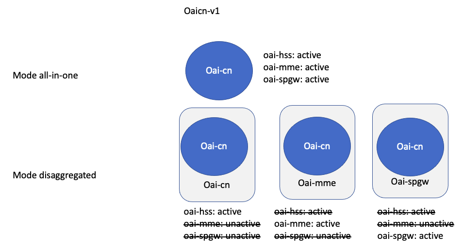
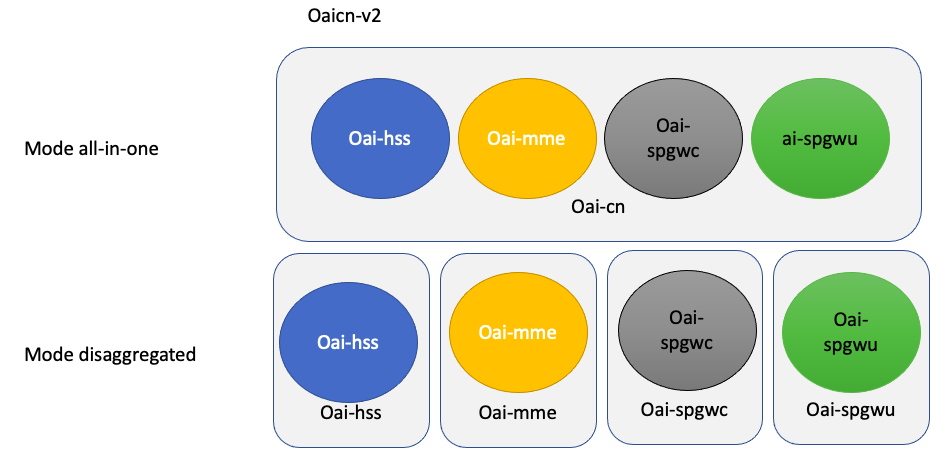

# kube5g demo on R2lab


This **kube5g.py** script aims to demonstrate how to automate a 4G deployment on R2lab using both nepi-ng and a kubernetes operator.

Kube5g stands for [Cloud-Native Agile 5G Service Platforms](https://mosaic5g.io/kube5g/), developed at Eurecom. Information and support regarding the Kubernetes **k5goperator** has been provided by Osama Arouk, Eurecom <osama.arouk@eurecom.fr>.


## What are the different steps?

First, the nepi-ng **kube5g.py** script will deploy a Kubernetes (k8s) infrastructure on the R2lab testbed.
By default, 4 fit nodes will be used, one master k8s node (fit01) and 3 worker k8s nodes (fit02, fit03 and fit23).

Once the k8s nodes are ready, the kube5g.py script will install the kube5g operator (called **k5goperator**) on the master node. 

This operator is responsible for launching the different OpenAirInterface VNFs to deploy the different flavors of a 4G network. The kube5g.py script will first apply configuration parameters specific to R2lab (such as the DNS IP address or some RAN parameters for the eNB). Then it will apply to the operator the CRD (custom resource definitions) corresponding to the 4G scenario to deploy. Afterwards, the kube5g operator is started and it will run on the worker nodes the different VNFs corresponding of the 4G scenario selected.

Different 4G scenarios are possible. Two versions of the core network (CN) are possible:

- v1: the CN is implemented with one VNF called **oai-cn** that includes the different 4G functions (hss, mme, spgw)
 

- v2: the CN is implemented with multiple VNFs (**oai-hss**, **oai-mme**, **oai-spgwc**, **oai-spgwu**)
 

And for both versions, it is possible to run them in two modes (*all-in-one* (all in the same pod, see Fig. ) or *disaggregated* (each VNF in a different pod, see Figure ).


Depending on the scenario, it takes between 1mn and 3mn for the operator to deploy the network, including the eNB (with the **oai-ran** VNF). The **k5goperator** operator integrates the scheduler that will decide in which worker node to run each pod, based on some labels (used for both pods and nodes). For instance, the oai-ran pod must be deployed on a specific node that corresponds to the machine connected to the USRP (B210) configured with the eNB duplexer.

Once the network is deployed, the nepi-ng script will switch on phones and will test the 4G connection with a speedtest.

It is then possible to log on the worker node and modify manually some configuration parameters or launch a new 4G scenario on top of the k8s/R2lab platform.

Note that there is an option `-K none` on the **kube5g.py** script to only deploy k8s and the **k5goperator**, which let the user manually start the 4G scenario it prefers, after tuning the configuration parameters.

## Play with the k5goperator

Log on the master node (through the R2lab **faraday** gateway, `ssh root@fit01`)

Then, with alias k=kubectl, first cd to the operator directory

```
cd ~/kube5g/openshift/kube5g-operator
```
### List the k8s master and worker nodes
```
root@master-node:~/kube5g/openshift/kube5g-operator# k get no
NAME          STATUS   ROLES    AGE   VERSION
fit02         Ready    <none>   55m   v1.19.4
fit03         Ready    <none>   55m   v1.19.4
fit23         Ready    <none>   55m   v1.19.4
master-node   Ready    master   56m   v1.19.4
```
### List the k8s pods
```
root@master-node:~/kube5g/openshift/kube5g-operator# k get po
NAME                               READY   STATUS    RESTARTS   AGE
kube5g-operator-8c5c9bd5f-qd4sb    1/1     Running   0          55m
mosaic5g-mysql-7684777595-dwl4x    1/1     Running   0          47m
mosaic5g-oaicnv1-75f48f944-xlbbm   1/1     Running   0          47m
mosaic5g-oairan-6876b74d4c-2ckpl   1/1     Running   0          46m
```
### Bring the v1 all-in-one network down

```
k delete -f deploy/crds/cr-v1/lte-all-in-one/mosaic5g_v1alpha1_cr_v1_lte_all_in_one.yaml
```
### Remove the kube5g-operator
```
./m5g_operator.sh container stop
```

### Launch the v2 disaggregated 4G scenario
```
./m5goperator.sh deploy v2 disaggregated-cn
```

### Remove CRDs
```
./m5g_operator.sh -c
```

### Test the network with R2lab phones
You can use the two android phones available on R2lab. They are controllable through the macphone1 and macphone2 hosts with the following commands:

- `phone-off` to switch on the air-plane mode

- `phone-on` to switch off the air-plane mode

- `phone-check-cx` to show the current network state along with the phone IP address

- `phone-reset` to reset the telephone with the default parameters; this takes about 2mn.

