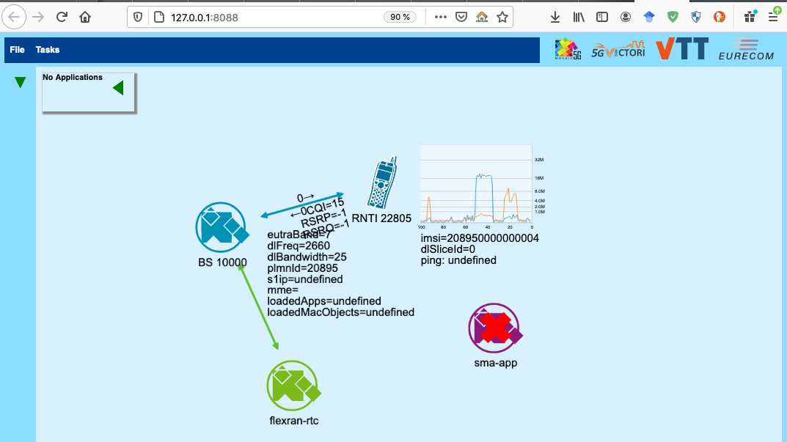

- [kube5g demo on R2lab](#kube5g-demo-on-r2lab)
  - [references](#references)
  - [the different steps](#the-different-steps)
    - [metal provisioning](#metal-provisioning)
    - [orchestrating the k8s cluster](#orchestrating-the-k8s-cluster)
  - [playing with the k5goperator](#playing-with-the-k5goperator)
    - [logging into the master node](#logging-into-the-master-node)
    - [list the k8s master and worker nodes](#list-the-k8s-master-and-worker-nodes)
    - [list the k8s kube5g/OAI pods](#list-the-k8s-kube5goai-pods)
    - [stop current deployment](#stop-current-deployment)
    - [remove the kube5g-operator](#remove-the-kube5g-operator)
    - [apply custom CRD](#apply-custom-crd)
    - [restart operator](#restart-operator)
    - [launch v1 disaggregated setup](#launch-v1-disaggregated-setup)
    - [ssh into a pod](#ssh-into-a-pod)
    - [change a CRD parameter](#change-a-crd-parameter)
    - [test phones connectivity](#test-phones-connectivity)
    - [cleanup](#cleanup)

# kube5g demo on R2lab

This **kube5g.py** script aims to demonstrate how to automate a 4G deployment on R2lab
using both nepi-ng and a kubernetes operator.

Kube5g stands for [Cloud-Native Agile 5G Service Platforms](https://mosaic5g.io/kube5g/),
developed at Eurecom.

_Acknowledgments: Support regarding the Kubernetes **k5goperator** has been provided by
Osama Arouk at Eurecom <osama.arouk@eurecom.fr>._

## References

* [R2lab welcome page](https://r2lab.inria.fr/)
* [R2lab run page (requires login)](https://r2lab.inria.fr/run.md)
* [github repo for this page](https://github.com/fit-r2lab/r2lab-demos)
* [Mosaic5G page on kube5g](https://mosaic5g.io/kube5g/)
* [source code for the operator](https://gitlab.eurecom.fr/mosaic5g/kube5g)

## The different steps...

### Metal provisioning

First, the nepi-ng **kube5g.py** script will deploy a Kubernetes (k8s) infrastructure on
the R2lab testbed. By default, 4 fit nodes will be used :

* one master k8s node (fit01)
* and 3 worker k8s nodes (fit02, fit03 and fit23)

Of course these defaults can be overridden on the command line.

### Orchestrating the k8s cluster

Once the k8s nodes are ready, the `kube5g.py` script will install the kube5g operator
(called **k5goperator**) on the master node.

This operator is responsible for launching the different OpenAirInterface VNFs to deploy
the different pieces of a 4G network. The `kube5g.py` script will first apply
configuration parameters specific to R2lab (such as the DNS IP address or some RAN
parameters for the eNB). Then it will apply to the operator the CRD (custom resource
definitions) corresponding to the 4G scenario to deploy. Afterwards, the kube5g operator
is started and it will run on the worker nodes the different VNFs corresponding of the 4G
scenario selected.

Two versions of the core network (CN) are possible:

* v1: the CN is implemented with one VNF called **oai-cn** that includes the different 4G
  functions (hss, mme, spgw)

  

* v2: the CN is implemented with multiple VNFs (**oai-hss**, **oai-mme**, **oai-spgwc**,
  **oai-spgwu**)

  

And for both versions, it is possible to run them in two modes (*all-in-one* (all in the
same pod) or *disaggregated* (each VNF in a different pod).

> Note: you select between both versions of the operator with  
> `kube5g.py -Ov1` or  
> `kube5g.py -Ov2`  
> with `kube5g.py -Onone`, `kube5g.py` will not start the operator, so you can run it
> yourself interactively from the master node (more about this below)

> Note: in v1 or v2 mode, the default is to use the *all-in-one* mode,
> you can turn on disaggregated modes with  
> `kube5g.py -D`

Depending on the scenario, it takes between 1mn and 3mn for the operator to deploy the
network, including the eNB (with the **oai-ran** VNF). The **k5goperator** operator
integrates the scheduler that will decide in which worker node to run each pod, based on
some labels (used for both pods and nodes). For instance in the context of R2lab, the
oai-ran pod must be deployed on a node that has a USRP (B210) configured with the eNB
duplexer (the `kube5g.py` script has node 23 as a default). The way the script actually
controls the operator, so that the eNB ends up being deployed on the node selected with
the `-R` option, is by setting the appropriate (kubernetes) label, which is then picked up
by the operator tool.

Once the network is deployed, the nepi-ng script will switch on phones and will test the
4G connection with a speedtest.

It is then possible to log on the worker node and modify manually some configuration
parameters or launch a new 4G scenario on top of the k8s/R2lab platform.

Note that using the **kube5g.py** option `-O none`, the script will only deploy k8s and
the **k5goperator**, and let the user manually start the 4G scenario it prefers, possibly
after tuning the configuration parameters.

## Playing with the k5goperator

So `kube5g.py` allows you to choose - again, using the `-O` option - the behaviour for the
operator tool; the idea behind the `-Onone` option is for when you want to run the
operator yourself interactively from the master node.

Note that the ability to run the operator interactively is also available if you have used
`-Ov1` or `-Ov2`, except that of course you will need to tear down any leftover
container/pod left behind by the previous run.

### Logging into the master node

In any case, you first need to log on the master node  
(here `inria_kube5g` is our slice name)

```bash
# first log into faraday using your slicename
me@mylaptop $ ssh inria_kube5g@faraday.inria.fr
[inria_kube5g@faraday ~]$
# from there login as root into the master node (fit01 by default in kube5g.py)
[inria_kube5g@faraday ~]$ ssh root@fit01
Last login: Fri Nov 27 12:42:47 2020 from 192.168.3.100
# we are now in the kubernetes master
# note that as a convenience kubectl is aliased to k
root@master-node:~#
root@master-node:~# type k
k is aliased to `kubectl'
```

Then, first cd to the operator directory

```bash
root@master-node:~# cd ~/kube5g/openshift/kube5g-operator
root@master-node:~/kube5g/openshift/kube5g-operator#
```

### List the k8s master and worker nodes

assuming you have run `kube5g.py -O v1`, you should see something like this :

```bash
root@master-node:~/kube5g/openshift/kube5g-operator# kubectl get nodes
NAME          STATUS   ROLES    AGE   VERSION
fit02         Ready    <none>   25m   v1.19.4
fit03         Ready    <none>   25m   v1.19.4
fit23         Ready    <none>   25m   v1.19.4
master-node   Ready    master   26m   v1.19.4
```

### List the k8s kube5g/OAI pods

```bash
root@master-node:~/kube5g/openshift/kube5g-operator# kubectl get pods
NAME                               READY   STATUS    RESTARTS   AGE
kube5g-operator-8c5c9bd5f-qd4sb    1/1     Running   0          55m
mosaic5g-mysql-7684777595-dwl4x    1/1     Running   0          47m
mosaic5g-oaicnv1-75f48f944-xlbbm   1/1     Running   0          47m
mosaic5g-oairan-6876b74d4c-2ckpl   1/1     Running   0          46m
```

### Stop current deployment

```bash
./k5goperator.sh -d
```

in our example this would terminate the 3 mosaic-* pods listed above

### Remove the kube5g-operator

Note that this is not required to start a new deployment

To remove the kube5g-operator:

```bash
./k5goperator.sh container stop
```

In our example this would terminate the last running pod; so at this point we start from
a clean slate (the same as if we had run `kube5g.py -Onone` in the first place).

### Apply custom CRD

then apply the custom resource definition (CRD)

```bash
./k5goperator.sh -n
```

### Restart operator

and restart the kube5g-operator

```bash
./k5goperator.sh container start
```

### Launch v1 disaggregated setup

Now, you're ready to launch the v1 disaggregated 4G scenario

```bash
./k5goperator.sh deploy v1 disaggregated-cn
```

### ssh into a pod

Get the name on the pod through `kubectl get pods`, then for instance, to log on the
**oai-ran** pod and check the logs:

```bash
root@master-node:~/kube5g/openshift/kube5g-operator# kubectl get pods | grep ran
mosaic5g-oairan-6876b74d4c-wspmh      1/1     Running   0          2m27s
root@master-node:~/kube5g/openshift/kube5g-operator# kubectl exec -it mosaic5g-oairan-6876b74d4c-wspmh -- bash
root@ubuntu:/# oai-ran.enb-journal -r |head
-- Logs begin at Fri 2020-11-20 15:39:45 UTC, end at Fri 2020-11-20 15:40:48 UTC. --
Nov 20 15:40:38 ubuntu oai-ran.enbd[969]: [ENB_APP]   TYPE <CTRL-C> TO TERMINATE
Nov 20 15:40:38 ubuntu oai-ran.enbd[969]: [LIBCONFIG] MCEs.[0]: 1/1 parameters successfully set, (1 to default value)
Nov 20 15:40:38 ubuntu oai-ran.enbd[969]: [LIBCONFIG] MCEs.[0]: 1/1 parameters successfully set, (1 to default value)****
```

### Change a configuration parameter

First make your modifications in the customized short version of kube5g configuration file `~/kube5g/common/config-manager/conf_short_r2lab.yaml` 

To apply it:

```bash
cd /root/kube5g/common/config-manager; ./conf-manager.py -s conf_short_r2lab.yaml
```
And to test it, for instance with v1/all-in-one scenario:

```bash
cd /root/kube5g/common/config-manager; ./conf-manager.py -s conf_short_r2lab.yaml
```

This command will destroy the current deployment (if any) and will (re)deploy the v1/all-in-one scenario with the modified parameters. 

### Notes on Configuration files, CRs and CRDs
There are different types of configuration files:

- default or customized short versions of kube5g configuration files: `common/config-manager/conf_short_default.yaml`, and `common/config-manager/conf_short_default.yaml` for R2lab.
- full version of kube5g configuration file: `common/config-manager/conf_global_default.yaml`.
- Custom Resource Definitions (CRDs) of kube5g-operator: `deploy/crds/*_crd.yaml`, **DO NOT MODIFY THEM**, as they are automatically generated by **operator-sdk**.
- Custom Resource (CR) of kube5g-operator: (`openshift/kube5g-operator/deploy/crds/cr-v1/\*`) and (`openshift/kube5g-operator/deploy/crds/cr-v1/\*`).


### How to test phones connectivity in R2lab?

Test the network with R2lab phones

You can use the two android phones available on R2lab.

They are controllable through the
macphone1 and macphone2 hosts with the following commands:

* `phone-off` to switch on the air-plane mode
* `phone-on` to switch off the air-plane mode
* `phone-check-cx` to show the current network state along with the phone IP address
* `phone-reset` to reset the telephone with the default parameters; this takes about 2mn.

To be clear, this is achieved in 2 steps :

* from `faraday`, use the `macphone1` or `macphone2` command to log into one of the macs in the room
* from there, issue one of the commands above to control the corresponding phone

Remember it is also possible to gain VNC access to these macs, as described [in the R2lab tutorials](https://r2lab.inria.fr/tuto-130-5g.md)

### Cleanup

If you ever need to remove the CRD, use

```bash
./k5goperator.sh -c
```
### Launch the demo with FlexRAN and the drone app

[FlexRAN](https://mosaic5g.io/flexran/) is a Flexible and Programmable Platform for Software-Defined Radio Access Networks.

Currently FlexRAN supports many apps such as monitoring, re- configurability through applications, mobility load balancing, network slicing and control delegation.

In this demo we focus on the monitoring functionality through the [drone app](https://gitlab.eurecom.fr/mosaic5g/mosaic5g/-/wikis/tutorials/store#application-drone), which allows real-time monitoring of many RAN metrics such as CQI & SNR measurements and UL/DL throughput performance.

Current version of the kube5G operator includes an option to run a FlexRAN pod on the node that hosts the eNB pod. However, it doesn't allow running the drone app. So, in this demo script, we added an option to launch the drone web server that connects to  FlexRAN once all the other pods are ready. We also added in the script the required ssh port forwarding utilities to allow running the drone client on your local machine. Basically, using the `-X` option, all the steps described above will be executed just before waking up the phone(s), and your default browser will automatically show up the drone app, as illustrated in the snapshot below.
