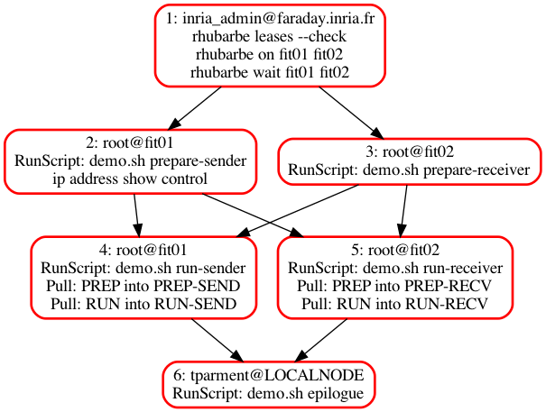

# My first `nepi-ng` script

This directory showcases the use of `nepi-ng` to create the simplest possible experiment:

* 2 nodes are involved (hardwired as `fit01` and `fit31`); one is a sender, and one is a receiver
* they are both accessible behind a gateway (`faraday.inria.fr`), that one is assumed to have ssh access to as a username that is also hardwired as `inria_r2lab.tutorial`

# Purpose

The experiment does not actually do anything on the nodes, just pretends to send or receive, instead it writes files that we gather at the end. We want to emphasize orchestration, and how to defer actual gory details to a shell script.

# Entry point

See file `demo.py` that is the actual `nepi-ng` code

# Dependencies

All this requires python-3.5.

Please note that `nepi-ng` is not a library per se, but more of a branding name; in order to install it you would run (add `sudo if needed`)

    pip3 install asynciojobs apssh

# Logic

The code in `demo.py` has a prelude that stores in `demo.dot` the sketch of this scenario. Using `dot` (install with `brew install graphviz` or similar), you can obtain a png file like this one, that depicts temporal relationships.

Note that on large scenarios, the scheduler can be instructed to use a maximal number of active jobs at any given time - see `Scheduler.orchestrate(window=)`
