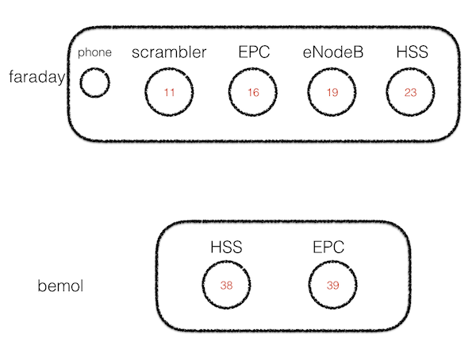

# Access to the MAC controlling the phone

## from another mac using *Screen sharing*

Use target `faraday.inria.fr` -> `tester/tester++`

## from faraday

```
macphone
```

## in both cases

```
help
phone status
```

# Note on base images - ubuntu 16 vs 14

Images are available for ubuntu 16 for now; they are named `oai16-gw-base` and `oai16-enb-base`.

I'm working on redoing the same for ubuntu14, the names will of course be `oaiu14*` when they are ready

# prep infra

## the HSS box

```
n 23
rload -i u16-oai-gw 23 16
rwait -t 120
ss
refresh
demo
```

## the EPC box

```
n 16
rwait -t 500
ss
refresh
demo
```
## the ENB box

```
n 19
rload -i u16-oai-enb 19 
rwait -t 300
ss
refresh
demo
```

## the scrambler box

```
n 11
rload -i oai-scrambler
rwait
ss
refresh
demo
```

# Run it

## common scenario for the 3 boxes

```
init
configure
start

logs
```

## the scrambler

```
scrambler [-blast]
```

*****
*****
*****


# Various notes


## DB report

```
select imsi, imei, access_restriction,  mmeidentity_idmmeidentity from users where imsi = 208950000000002;

select * from mmeidentity where mmerealm='r2lab.fr' ;
```
